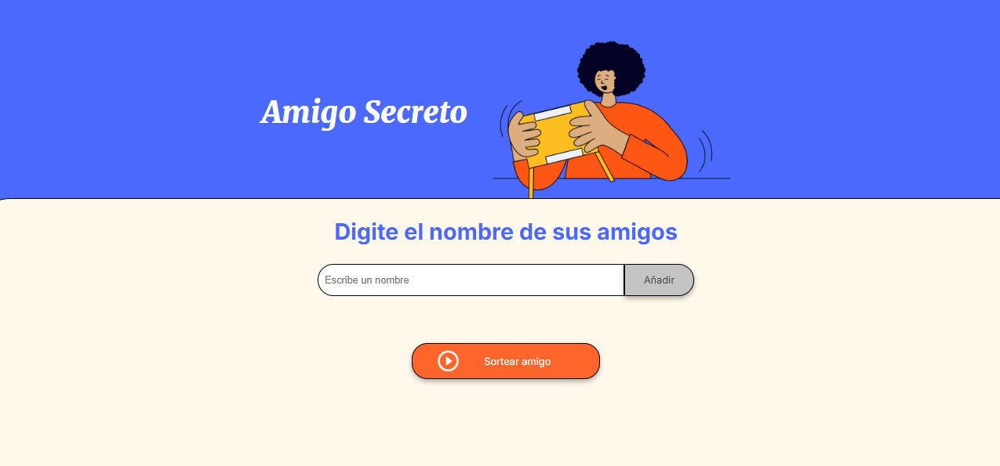
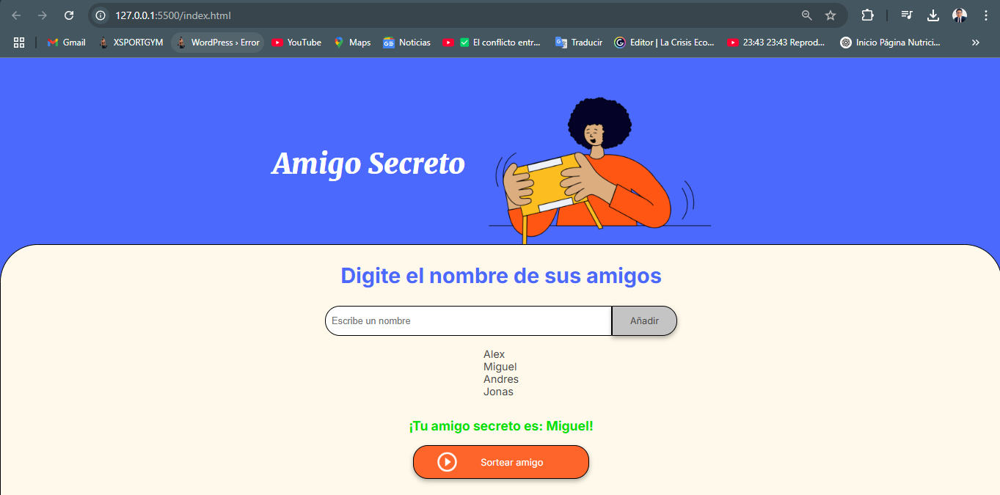

# ChallengeAmigoSecreto
Equipo ONE

¡Bienvenido al juego de **Amigo Secreto**! Este proyecto permite a los usuarios agregar los nombres de sus amigos y luego sortear de manera aleatoria uno de los nombres, de forma divertida y sencilla.

## Descripción

Este es un juego interactivo donde puedes agregar los nombres de tus amigos en un campo de texto y luego hacer clic en el botón "Añadir" para agregarlos a la lista. Después, con el botón "Sortear Amigo", el juego selecciona aleatoriamente uno de los amigos que has agregado y muestra el nombre del amigo sorteado.



### Funcionalidades:
1. **Agregar amigos**: Los usuarios escriben el nombre de sus amigos en un campo de texto y lo agregan a la lista visible.
2. **Validación de entrada**: Si el campo de texto está vacío, el sistema muestra una alerta pidiendo un nombre válido.
3. **Visualizar la lista**: Los nombres ingresados aparecen en una lista debajo del campo de entrada.
4. **Sortear amigo secreto**: Al hacer clic en el botón "Sortear Amigo", se selecciona aleatoriamente un nombre de la lista y se muestra en la página.



## Instalación

1. **Clona el repositorio**:
   ```bash
   git clone https://github.com/EMagipo20/ChallengeAmigoSecreto.git
